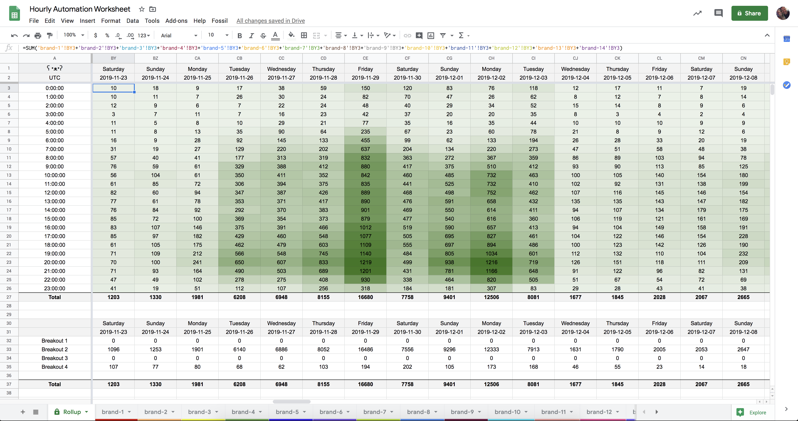
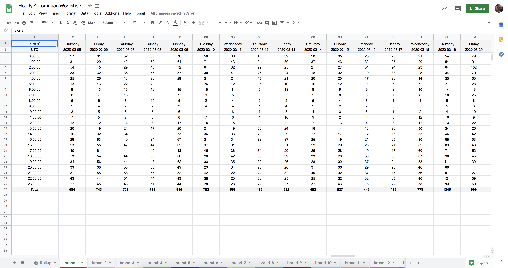
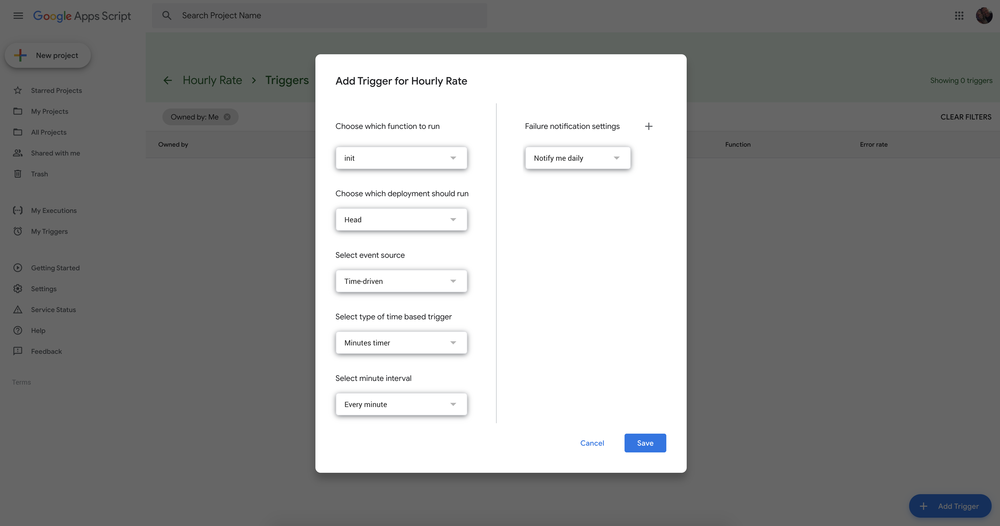

# Google Apps Script - Hourly Rate Monitor
This repository contains the code to create an hourly tracker in Google Sheets. It's very useful for Ecommerce application monitoring but could easily be retrofitted to other uses.




# Intro
As mentioned above, this utilizes a script which calls an API in Apigee, which in turn calls OCAPI inside Salesforce Commerce Cloud. For my purposes, this is to gather order data for all brands in SFCC, once an hour, 24/7/365. This is just the setup I have, and is not entirely necessary. If you have a different API, it can easily be substituted and retrofit for other applications.

# Prerequisites
1. [Google Account](https://accounts.google.com/)
2. [Apigee Edge Account](https://login.apigee.com/login) or a working API somewhere.
    * Keep in mind this script assumes a specific response. Depending on your API response you'll need to adjust accordingly.
3. A Google Sheet formatted similarly to this.

# Trigger
Once you have your script written and adjusted to your needs, you'll want to create the trigger to kick this off every minute.


# Details
Example response from my Apigee API which pulls data from OCAPI, plucks our necessary data and creates a new json body, discarding the leftover data which may or may not be sensitive.
```
{
    "_v": "19.5",
    "_type": "order_search_result",
    "side_id": "brand",
    "order_count": "56"
}
```

# LICENSE
See the [MIT LICENSE](https://github.com/nighthauk/appsscript-rate-monitor/blob/master/LICENSE) file.